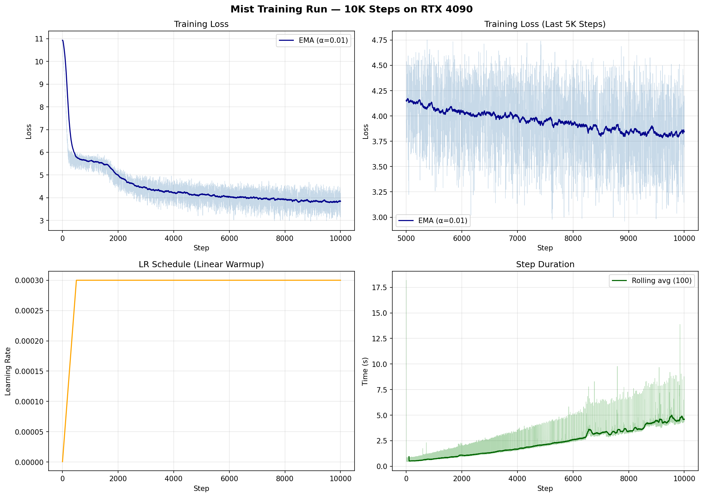

# mist

A tiny diffusion language model built from scratch in [tinygrad](https://github.com/tinygrad/tinygrad).

Text doesn't have to be generated left-to-right. `mist` starts from pure noise (every token masked) and iteratively denoises until coherent text emerges.

Based on [MDLM](https://arxiv.org/abs/2406.07524) (Masked Diffusion Language Models).

## Why

Autoregressive generation (GPT-style, predict next token) is one way to do language modelling. Diffusion is another method where you start from noise and refine toward signal. Image diffusion models proved this works incredibly well for continuous data. Discrete diffusion applies the same idea to token sequences.

This project exists to build that from first principles in a minimal framework and understand every piece. Not trying to beat any benchmarks, just trying to really get how this works for my own learning.

## How It Works

During training, we take clean text, sample a random timestep, and mask tokens at a rate determined by that timestep. The model's job is to learn to predict what's behind the masks.

```
"the cat sat on the mat"    →    "the [M] sat [M] the [M]"    →    "[M] [M] [M] [M] [M] [M]"
         clean                        partial noise                      full noise
```

At inference time, we start from a fully masked sequence and iteratively unmask it. Each step, the model predicts all positions at once and we reveal the ones it's most confident about. Over ~50 steps, text emerges from the mist.

```
"[M] [M] [M] [M] [M] [M]"  →  "[M] cat [M] [M] [M] [M]"  →  "the cat sat on the mat"
```

Because all positions are predicted in parallel, there's no left-to-right bottleneck like you'd have with autoregressive models.

## Architecture

The core is a small transformer with timestep conditioning. The forward and reverse diffusion processes are just math, so the denoising model is the only thing actually being trained.

| Component          | What it does                                                             |
| ------------------ | ------------------------------------------------------------------------ |
| Token Embedding    | Maps vocab to vectors, with a learned `[MASK]` embedding                 |
| Timestep Embedding | Sinusoidal encoding fed through an MLP, injected via adaptive layer norm |
| Transformer Blocks | Self-attention + FFN + LayerNorm, nothing exotic                         |
| Output Head        | Projects to vocab logits, with CE loss computed on masked positions only |

Trained on [TinyStories](https://huggingface.co/datasets/roneneldan/TinyStories), a dataset of short children's stories that is small enough to train on a single GPU in about an hour.

## Training

The model was trained for 10,000 steps on an RTX 4090 via RunPod. The full run cost under $4 and took roughly 6.5 hours of wall time (though the actual compute time per step was much lower, as explained below).

| Param             | Value                                     |
| ----------------- | ----------------------------------------- |
| Parameters        | ~33M                                      |
| Vocab             | 50,257 (GPT-2 BPE via tiktoken)           |
| Dim               | 256                                       |
| Heads             | 8                                         |
| Layers            | 6                                         |
| Seq length        | 128                                       |
| Batch size        | 64                                        |
| Optimiser         | Adam, lr=3e-4 with 500-step linear warmup |
| Gradient clipping | max norm 1.0                              |

### Training Curves



The **top left** panel shows the full loss trajectory. The model starts at ~10.9, which is ln(50,257) and corresponds to uniform random guessing across the entire GPT-2 vocabulary. Within the first 1,000 steps the loss drops sharply to around 5.5, which is where the model picks up basic token frequencies and common English word patterns. It then continues to descend more gradually through steps 1,000 to 4,000 before settling into the 3.5 to 4.5 range.

The **top right** panel zooms into the last 5,000 steps and reveals that the EMA was still gently declining from about 4.2 to 3.85 by the end of training, which means the model had not fully plateaued and could likely benefit from additional steps. The high per-batch variance (individual losses bouncing between 3.0 and 4.75) is expected given the diversity of the dataset relative to the batch size.

The **bottom left** panel shows a clean linear warmup over the first 500 steps up to 3e-4, followed by a constant learning rate for the remainder of training, which kept things stable with no signs of divergence.

The **bottom right** panel is the most telling. Step duration starts at around 0.5 seconds for the first ~1,000 steps, but then begins climbing steadily and reaches roughly 5 seconds per step by the end of training. I chose to stream the dataset from HuggingFace rather than downloading it to disk, which seemed reasonable at the time since TinyStories is roughly 2 GB and I didn't think the latency would matter much. Turns out it matters a lot. As the iterator moves deeper into the dataset's parquet shards, the network fetch latency compounds and the GPU ends up sitting idle waiting for the next batch. The occasional spikes to 10 to 18 seconds are likely shard boundaries where a new file needs to be downloaded. What should have been a ~90 minute run ended up taking over 6 hours, which is a bit embarrassing in hindsight. Lesson learned: just download the data.

### Sample Outputs

```
Once upon a time, there was a little girl. She was very old, full of buttons.
On her toys, and one day, she decided to do you and exciting. One day, all the
teacher needed a special job with something she came true.
```

```
Once upon a time there was a 3 year old. She was very excited to have some cook.
The bowl made delicious a delicious cake. Every day would show it out, she decided
to make something special.
```

The outputs are rough but recognisably English, with clear story structure ("Once upon a time"), character references, and sentence-level coherence. Grammar breaks down over longer spans and the stories tend to lose the thread after a few sentences, which is about what you would expect from a 33M parameter model trained for only 10K steps.

## Training on Modal

Training runs on [Modal](https://modal.com), so your local machine only submits the job — you can close your laptop, go to sleep, and the run keeps going on Modal's infrastructure.

```bash
uv sync                          # installs modal + the rest of the deps
uv run modal setup               # one-time auth

uv run modal run --detach modal_app.py --steps 20000 --run-name v2
```

Checkpoints and the training log land on a persistent Modal volume under `<run_name>/`. Pull them back with:

```bash
uv run modal volume get mist-checkpoints v2/model_20000.safetensors ./
uv run modal volume get mist-checkpoints v2/train_log.csv ./
```

Pass `--slack-webhook-url=$SLACK_WEBHOOK_URL` to get a ping on completion or failure. GPU and other knobs live in `modal_app.py`.

## Sampling

Checkpoints are not included in the repo due to their size (~125 MB each), but training is cheap enough that you can just run it yourself (a few dollars on a 4090, about 90 minutes once the data loading fix from the next steps is applied).

```bash
uv run python sample.py --checkpoint checkpoints/model_10000.safetensors --num-samples 3
```

To watch the diffusion process in real time (tokens materialising from noise):

```bash
uv run python sample.py --checkpoint checkpoints/model_10000.safetensors --stream
```

In streaming mode, confirmed tokens appear in **bold** while the model's current predictions at still-masked positions appear in dim text, so you can see the full sequence evolving at each denoising step.

## Progress

### Phase 1: Core

- [x] Transformer with timestep conditioning
- [x] Absorbing-state forward process (masking schedule)
- [x] Reverse process (iterative unmasking)
- [x] Training loop
- [x] Sampling / generation

### Phase 2: Train

- [x] Train on TinyStories (10K steps, RTX 4090)
- [x] Get coherent generations
- [ ] Tune noise schedule, sampling steps

### Phase 3: Make It Cool

- [x] Step-by-step denoising visualisation
- [x] Loss curves
- [ ] Comparison of generation quality vs number of denoising steps
- [ ] Prefix conditioning (provide the first few tokens, let the model complete the rest)

## Findings and Next Steps

The first training run surfaced a few concrete things to improve for the next one:

1. **Download the dataset to disk instead of streaming it.** The step time graph makes it clear that data loading became the bottleneck well before training was done, with the GPU utilisation dropping from 100% to around 65% as the streaming iterator moved deeper into the dataset. Pre-downloading TinyStories (~2 GB) would eliminate this entirely and likely cut total training time in half.

2. **Train for longer.** The loss was still declining at 10K steps, so there is room to push further. Doubling to 20K steps with the data loading fix would still finish in a couple of hours and stay well within budget.

3. **Add cosine LR decay.** The current schedule is a simple linear warmup followed by a constant rate. A cosine decay toward zero over the full run would give the optimiser a better chance to settle into sharper minima during the later stages of training.

4. **Add prefix conditioning.** The model currently generates unconditionally (just random stories from noise). Adding the ability to fix the first N tokens and only denoise the rest would make sampling more interactive and useful, and requires almost no changes to the architecture since the model already predicts all positions in parallel.

5. **Try different sampling temperatures and step counts.** The current defaults (temperature=0.8, 50 steps) were chosen without much tuning. A systematic comparison of generation quality across different settings would help find a better sweet spot.

## Project Structure

```
mist/
├── config.py      # shared constants (vocab size, tokeniser)
├── model.py       # transformer + timestep conditioning
├── diffusion.py   # noise schedule, forward corruption, reverse sampling
├── train.py       # training loop with CSV logging
├── sample.py      # generate text, visualise the denoising process
└── modal_app.py   # Modal entry point for cloud training
```

## Key Decisions

**Why tinygrad?** The whole point is to implement everything myself. Tinygrad's op set is minimal enough that you can't hide behind abstractions. If it works, you understand it and I've been wanting to try tinygrad for a while.

**Why MDLM specifically?** Absorbing-state diffusion (tokens get masked, model unmasks them) is the most intuitive discrete diffusion formulation. It's conceptually close to BERT-style masked language modelling, but with a proper diffusion framework on top. It's also way easier to debug than score-based approaches like SEDD.

**Why not autoregressive?** Fewer people have built a diffusion LM from scratch, and even fewer in tinygrad. Diffusion generation also has some genuinely interesting properties like parallel decoding, the ability to revise all positions simultaneously, and controllable generation via guidance.

## References

- [Simple and Effective Masked Diffusion Language Models](https://arxiv.org/abs/2406.07524) (Sahoo et al., 2024)
- [Structured Denoising Diffusion Models in Discrete State-Spaces](https://arxiv.org/abs/2107.03006) (Austin et al., 2021) - D3PM, foundational discrete diffusion work
- [Score Entropy Discrete Diffusion](https://arxiv.org/abs/2310.16834) (Lou et al., 2024) - SEDD, alternative approach

## License

MIT
